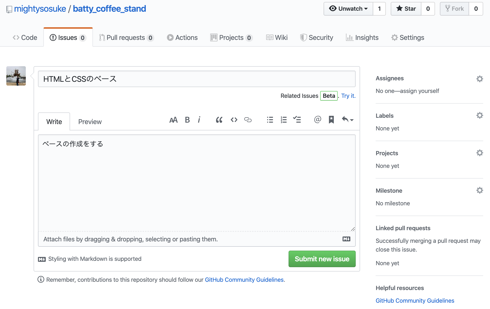
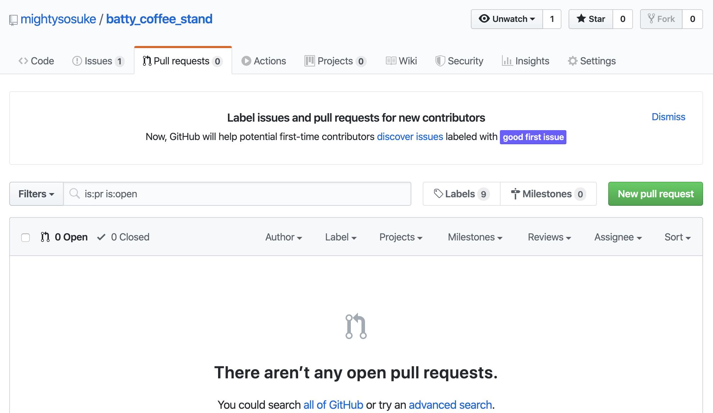

# Git Flow と Issue 管理の擬似体験

## 目的

1. Git Flow を使って開発効率を上げること
2. GitHub の Issue を使って、自分のタスクをうまく管理できるようにすること
3. ローカルの開発環境での開発を体験してみること

## 参考資料

https://qiita.com/fukubaka0825/items/c7710b4e87d478c8ba3b

## Git Flow について

Git には、開発しやすくするためのモデルがあります。<br>
そのうちの一つが Git Flow です。

[参考サイト](https://www.sejuku.net/blog/74224)

今回の擬似体験では、master、develop、feature ブランチの 3 つを使います。

**`master ブランチ`**

master ブランチには常に安定して動く、リリースした後のコードを置いておきます。<br>git flow ではこのブランチに直接コミットをすることはないので気をつけましょう。

**`develop ブランチ`**

develop ブランチでは次のバージョンをリリースするために、最新の開発履歴を残しておきます。<br>言わば git flow を使った開発の中心となるブランチで、常に最新の変更が加えられているブランチになります。

**`feature ブランチ`**

feature ブランチは、develop ブランチから分岐しているブランチです。<br>この feature ブランチでは新しく追加する機能の開発や、簡単なバグの修正を行うことが出来ます。<br>feature ブランチを変更する機能の数だけ切って、その中で個々の機能についての変更を行っていきます。<br>このブランチで作業し終わったあとはこのブランチは削除するのが一般的です。

## 環境構築

1. VSCode をインストールする

https://code.visualstudio.com/

2. XCode をインストールする

コマンド入力後、インストール確認のポップアップが出たらインストールをクリック

```zsh
$ xcode-select --install
```

3. Homebrew を入れる

https://brew.sh/index_ja.html?_fsi=JrbahF8d

```zsh
# git-flowの導入
$ brew install git-flow

# 動作確認
$ git flow

# これが出たらOK！
usage: git flow <subcommand>

Available subcommands are:
   init      Initialize a new git repo with support for the branching model.
   feature   Manage your feature branches.
   release   Manage your release branches.
   hotfix    Manage your hotfix branches.
   support   Manage your support branches.
   version   Shows version information.

Try 'git flow <subcommand> help' for details.
```

## プロジェクトの準備

1. 好きな場所に「 batty_coffee_stand 」ディレクトリを作成

techboost の受講中コースから、「Front05 HTML と CSS でサイトを作成していく」を開く

```zsh
$ mkdir batty_coffee_stand
$ cd batty_coffee_stand
$ touch index.html
$ mkdir css

# 前のコマンドの引数のディレクトリに移動
$ cd $_
$ touch style.css

# 一つ上のディレクトリに移動
$ cd ..
$ mkdir image

```

## Git と GitHub の準備

1. リモートリポジトリの作成

batty_coffee_stand を作成

[GitHub のページ](https://github.com/)

2. 鍵の作成

```zsh
$ mkdir ~/.ssh
$ chmod 700 ~/.ssh
$ cd ~/.ssh

# githubのemailは自分のemailアドレス
$ ssh-keygen -t rsa -b 4096 -C "githubのemail"

# その後、Enterキーを3回
```

3. 鍵の登録

```zsh
$ cat id_rsa.pub
```

表示結果のうち「ssh-rsa」から最後の「自分のメールアドレス」までが公開鍵の「内容」です。<br>これをコピーして以下の URL より GitHub に公開鍵を登録します。

https://github.com/settings/ssh

画面右上の「New SSH key」のボタンを押してください。<br>「Title」に任意の公開鍵名(local など)を、「Key」に先ほどコピーした公開鍵の内容をペーストします。

```zsh
$ ssh -T git@github.com
```

4. ローカルリポジトリの作成

```zsh
# ホームディレクトリ に戻る
$ cd
$ cd batty_coffee_standのディレクトリ
```

```zsh
$ git init

# git@より後ろは、GitHubのSSHというところから引っ張ってきます。
$ git remote add git@github.com:アカウント名/GitIssues.git
$ git add .
$ git commit -m "first commit"
$ git push origin master
```

```zsh
# git flowの設定をするコマンド
$ git flow init -d

$ git push origin develop

# リモートブランチを含むブランチの確認
$ git branch -a
```

## Issue 管理をしてみる

1. GitHub の「New issue」から Issue を作成


2. Title と comment を以下の Issue の通りに埋めて、「Submit new issue」をクリック



**Issue1**

```zsh
# Title
HTMLとCSSのベース

# comment
ベースの作成をする
```

**Issue2**

```zsh
# Title
ヘッダーを実装する

# comment
タイトル部分の実装
ナビゲーション部分の実装
```

**Issue3**

```zsh
# Title
コンテンツ部分を実装する

# comment
共通要素の取り出し
2カラムレイアウト
Informationの実装
Staffの実装
Accessの実装
```

**Issue4**

```zsh
# Title
フッターを実装する

# comment
フッターを実装して完成
```

## ブランチを切る

```zsh
# featureの'#1'という名前のブランチを切る
$ git flow feature start '#1'

# ブランチを表示する
$ git branch
```

'#1'というのは、先ほど作成した Issue の Title についている番号のことです。

## ソースコードを修正する

1. Issue に合わせてソースコードを修正

&emsp;&emsp;各 Issue は、「Front05 HTML と CSS でサイトを作成していく」と紐づいています。

2. VSCode でファイルオープン

## プルリクをしてマージする

1. リモートに push する

`ポイント`

コミットメッセージに必ず issue 番号をつけること
<br>そうすることで、commit が GitHub 上の issue と結びつきます。

```zsh
# ステージング状態にする
$ git add .

# コミットする(コミットコメントにIssueの番号をつける)
# コミットメッセージはIssueのTitleと同じにしておきます
$ git commit -m "HTMLとCSSのベース #1"

# リモートにプッシュする
$ git push origin 'feature/#1'
```

2. GitHub の「New pull request」から pull request を作成



3.

## ブランチを削除する

```zsh
# developへの移動
$ git checkout develop

# pullして、developを最新の状態にする
$ git pull origin develop

# feature/#1を削除する
$ git branch -d 'feature/#1'

# branchの状態を確認する
$ git branch
```

## Issue をクローズする

## 残りの Issue を片付ける

#2〜＃4 の Issue も全てクローズさせる

## master <- develop のマージをする
